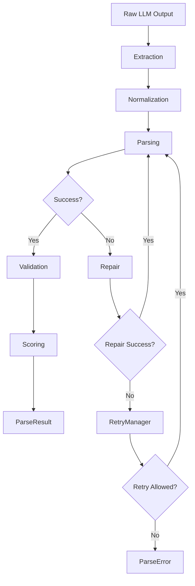

# Design Document: parsecraft

*A property is a characteristic or behavior that should hold true across all valid executions of a system-essentially, a formal statement about what the system should do. Properties serve as the bridge between human-readable specifications and machine-verifiable correctness guarantees.*

## Overview

parsecraft is a production-grade Python library that provides a model-agnostic LLM output reliability layer. It transforms messy, unstructured LLM responses into valid, structured data through a robust 7-stage pipeline:

```
Raw LLM Output
    ↓
[Extraction]    → Extract JSON from code fences or raw text
    ↓
[Normalization] → Remove BOM, standardize line endings, normalize whitespace
    ↓
[Parsing]       → Parse JSON into Python objects, validate against schema
    ↓
[Repair]        → Attempt automatic fixes for common JSON errors
    ↓
[Validation]    → Validate parsed data against schema constraints
    ↓
[Retry]         → Retry with exponential backoff for transient failures
    ↓
[Scoring]       → Calculate reliability score (0.0-1.0)
    ↓
ParseResult (or ParseError)
```

The library is designed for fault tolerance, extensibility, and observability, with property-based testing for all correctness properties.

## Architecture

### Pipeline Architecture

The pipeline is orchestrated by the `Pipeline` class, which coordinates all 7 stages in sequence. Each stage is implemented as a separate, testable component with clear interfaces.



### Component Relationships

```
┌─────────────────────────────────────────────────────────────┐
│                     OutputParser (API)                      │
│  - parse(text, schema, **options)                          │
└─────────────────────────────────────────────────────────────┘
                            │
                            ▼
┌─────────────────────────────────────────────────────────────┐
│                      Pipeline (Orchestrator)                │
│  - execute_stage(stage, input)                             │
│  - handle_error(stage, error)                              │
│  - retry_with_backoff(operation)                           │
└─────────────────────────────────────────────────────────────┘
                            │
        ┌───────────────────┼───────────────────┐
        ▼                   ▼                   ▼
┌──────────────┐  ┌──────────────┐  ┌──────────────┐
│   Extractor  │  │  Normalizer  │  │   Parser     │
│ - extract()  │  │ - normalize()│  │ - parse()    │
└──────────────┘  └──────────────┘  └──────────────┘
        │                   │                   │
        ▼                   ▼                   ▼
┌──────────────┐  ┌──────────────┐  ┌──────────────┐
│   Repairer   │  │  Validator   │  │ RetryManager │
│ - repair()   │  │ - validate() │  │ - retry()    │
└──────────────┘  └──────────────┘  └──────────────┘
        │                   │                   │
        ▼                   ▼                   ▼
┌──────────────┐
│   Scorer     │
│ - score()    │
└──────────────┘
```

### Data Flow

1. **Extraction**: Raw text → JSON string (extracted from code fences if present)
2. **Normalization**: JSON string → Cleaned JSON string (BOM removed, line endings standardized, whitespace normalized)
3. **Parsing**: JSON string → Python dict (parsed and validated against schema)
4. **Repair**: (if parsing fails) Invalid JSON → Fixed JSON string (using repair strategies)
5. **Validation**: Python dict → Validated data (checked against schema constraints)
6. **Retry**: (if transient failure) Operation → Retry with backoff
7. **Scoring**: Pipeline results → Reliability score (0.0-1.0)

### Error Handling Strategy

Errors are handled at each stage with stage-specific exceptions:

- **ExtractionError**: No JSON-like content found
- **NormalizationError**: Normalization fails
- **ParseError**: Invalid JSON or schema mismatch
- **RepairError**: All repair strategies failed
- **ValidationError**: Schema validation failed
- **RetryError**: Retry limit exceeded
- **ScoringError**: Scoring failed

Errors are aggregated and wrapped in a `ParseError` with full context when the pipeline fails.

### Observability Approach

- Structured logging for each pipeline event
- Logging is optional and controlled by configuration
- Logs include: stage name, input/output size, duration, errors, repair attempts
- Supports both sync and async logging

## Core Components

### 1. Extractor

**Purpose**: Extract JSON content from raw LLM output.

**Key Methods**:
- `extract(text: str) -> str`: Extract JSON from text

**Behavior**:
- Look for JSON code fences (```json ... ``` or ``` ... ```)
- If no JSON fences, search for any code fence and extract JSON within
- If no code fences, return entire text if it appears to be JSON
- Raise `ExtractionError` if no JSON-like content found
- Return first valid JSON object when multiple present

**Repair Strategies**:
- Trailing comma removal
- Single quote to double quote conversion
- Unquoted key handling
- Invalid escape sequence handling
- LLM-based repair (when configured)

### 2. Normalizer

**Purpose**: Clean text formatting issues.

**Key Methods**:
- `normalize(text: str) -> str`: Normalize text

**Behavior**:
- Remove BOM sequences
- Standardize line endings to LF
- Normalize excessive whitespace (multiple spaces, tabs at line start)
- Preserve semantic content
- Skip transformations that would alter semantic meaning

### 3. Parser

**Purpose**: Parse JSON and validate against schema.

**Key Methods**:
- `parse(json_str: str, schema: Union[Type[BaseModel], dict]) -> dict`: Parse and validate

**Behavior**:
- Parse valid JSON into Python dict
- Validate against Pydantic models
- Validate against JSON Schema definitions
- Raise `ParseError` for schema mismatches
- Raise `ParseError` for invalid JSON syntax

### 4. Repairer

**Purpose**: Automatically repair invalid JSON.

**Key Methods**:
- `repair(json_str: str, original_error: Exception) -> str`: Attempt repair

**Behavior**:
- Try repair strategies in order of increasing complexity
- Log original error and repair attempt for observability
- Raise `RepairError` if all strategies fail
- Support LLM-based repair when configured

**Repair Strategies** (in order):
1. Trailing comma removal
2. Single quote to double quote conversion
3. Unquoted key handling
4. Invalid escape sequence handling
5. LLM-based regeneration (if configured)

### 5. Validator

**Purpose**: Validate parsed data against schema.

**Key Methods**:
- `validate(data: dict, schema: Union[Type[BaseModel], dict], mode: str = 'strict') -> List[ValidationError]`: Validate data

**Behavior**:
- Check required fields are present
- Check field types match schema
- Validate constraints (min/max values, patterns, enums)
- Support strict and lenient modes
- Collect and return all validation errors

### 6. RetryManager

**Purpose**: Handle retries with exponential backoff.

**Key Methods**:
- `retry(operation: Callable, max_retries: int, retryable_errors: Set[Type[Exception]]) -> Any`: Retry operation

**Behavior**:
- Retry on retryable errors (network failure, rate limit)
- Stop after reaching max retry limit
- Respect retry configuration for non-retryable errors
- Raise final error with retry context when exhausted

**Backoff Strategy**:
- Exponential backoff: `delay = base_delay * 2^n`
- Jitter: `delay = delay * (1 + random.uniform(-0.1, 0.1))`
- Maximum delay: configurable

### 7. Scorer

**Purpose**: Calculate reliability score.

**Key Methods**:
- `score(result: ParseResult) -> float`: Calculate score

**Behavior**:
- Return 1.0 for perfect output (no repairs, no warnings)
- Return 0.5-0.99 based on repair complexity
- Reduce score based on parsing attempt count
- Reduce score for validation warnings
- Ensure score in range [0.0, 1.0]

**Scoring Formula**:
```
score = 1.0
    - (repair_complexity * 0.1)
    - (attempt_count - 1) * 0.05
    - (validation_warnings * 0.02)
    - (min(0, score), 0.0)
```

### 8. Pipeline

**Purpose**: Orchestrate all stages.

**Key Methods**:
- `execute_stage(stage: Stage, input: Any) -> Any`: Execute single stage
- `handle_error(stage: Stage, error: Exception) -> Any`: Handle error
- `retry_with_backoff(operation: Callable) -> Any`: Retry with backoff

**Behavior**:
- Execute stages in order: Extraction → Normalization → Parsing → Repair → Validation → Retry → Scoring
- Invoke Repair stage when parsing fails and repair is possible
- Raise `ParseError` with full context after all retries exhausted
- Support observability logging
- Support both synchronous and asynchronous operation

## Data Models

### ParseResult

Return object from successful parsing.

```python
@dataclass
class ParseResult:
    parsed_data: Any  # The parsed data (dict, list, or Pydantic model)
    reliability_score: float  # 0.0-1.0
    repair_history: List[RepairAttempt]  # History of repair attempts
    validation_errors: List[ValidationError]  # Validation warnings
    stage_results: Dict[str, Any]  # Results from each stage
    
    def to_dict(self) -> dict:
        """Serialize to dictionary for observability."""
        return {
            'parsed_data': self.parsed_data,
            'reliability_score': self.reliability_score,
            'repair_history': [r.to_dict() for r in self.repair_history],
            'validation_errors': [e.to_dict() for e in self.validation_errors],
            'stage_results': self.stage_results
        }
```

### ParseError

Exception with full context on failure.

```python
class ParseError(Exception):
    def __init__(
        self,
        message: str,
        original_input: str,
        failed_stage: str,
        specific_error: Exception,
        result: Optional[ParseResult] = None,
        repair_history: Optional[List[RepairAttempt]] = None,
        validation_errors: Optional[List[ValidationError]] = None
    ):
        self.message = message
        self.original_input = original_input
        self.failed_stage = failed_stage
        self.specific_error = specific_error
        self.result = result
        self.repair_history = repair_history or []
        self.validation_errors = validation_errors or []
        self.is_user_error = self._determine_error_type()
        
    def _determine_error_type(self) -> bool:
        """Determine if this is a user error (invalid input) or system error."""
        return self.failed_stage in ['Extraction', 'Normalization', 'Parsing']
    
    def __str__(self) -> str:
        parts = [self.message]
        parts.append(f"Failed at stage: {self.failed_stage}")
        parts.append(f"Original input: {self.original_input[:100]}...")
        if self.specific_error:
            parts.append(f"Specific error: {self.specific_error}")
        if self.repair_history:
            parts.append(f"Repair attempts: {len(self.repair_history)}")
        if self.validation_errors:
            parts.append(f"Validation errors: {len(self.validation_errors)}")
        return "\n".join(parts)
```

### ParserConfig

Immutable configuration class.

```python
@dataclass(frozen=True)
class ParserConfig:
    max_retries: int = 3
    timeout: float = 30.0
    repair_enabled: bool = True
    observability_enabled: bool = False
    repair_strategies: List[str] = field(default_factory=lambda: [
        'trailing_comma',
        'single_quotes',
        'unquoted_keys',
        'escape_sequences',
        'llm_repair'
    ])
    
    def validate(self) -> None:
        """Validate configuration and raise ConfigurationError if invalid."""
        if self.max_retries < 0:
            raise ConfigurationError("max_retries must be non-negative")
        if self.timeout <= 0:
            raise ConfigurationError("timeout must be positive")
        if not isinstance(self.repair_strategies, list):
            raise ConfigurationError("repair_strategies must be a list")
    
    def with_overrides(self, **kwargs) -> 'ParserConfig':
        """Create new config with overrides (for per-call configuration)."""
        return dataclasses.replace(self, **kwargs)
```

### RepairAttempt

Records a single repair attempt.

```python
@dataclass
class RepairAttempt:
    strategy: str
    success: bool
    original_error: str
    repaired_text: Optional[str] = None
    timestamp: datetime = field(default_factory=datetime.now)
    
    def to_dict(self) -> dict:
        return {
            'strategy': self.strategy,
            'success': self.success,
            'original_error': self.original_error,
            'repaired_text': self.repaired_text,
            'timestamp': self.timestamp.isoformat()
        }
```

### ValidationError

Records a single validation error.

```python
@dataclass
class ValidationError:
    field: str
    message: str
    expected_type: Optional[str] = None
    actual_value: Optional[Any] = None
    
    def to_dict(self) -> dict:
        return {
            'field': self.field,
            'message': self.message,
            'expected_type': self.expected_type,
            'actual_value': str(self.actual_value) if self.actual_value is not None else None
        }
```

## API Design

### Main Entry Point

```python
class OutputParser:
    def __init__(self, config: Optional[ParserConfig] = None):
        self.config = config or ParserConfig()
        self.pipeline = Pipeline(self.config)
    
    def parse(
        self,
        text: str,
        schema: Union[Type[BaseModel], dict, None] = None,
        **options
    ) -> ParseResult:
        """
        Parse LLM output and return structured data.
        
        Args:
            text: Raw LLM output
            schema: Pydantic model or JSON Schema for validation
            **options: Override configuration (max_retries, timeout, etc.)
            
        Returns:
            ParseResult with parsed_data, reliability_score, repair_history
            
        Raises:
            ParseError: If parsing fails after all retries
        """
        config = self.config.with_overrides(**options)
        return self.pipeline.execute(text, schema, config)
```

### Usage Examples

```python
# Basic usage
parser = OutputParser()
result = parser.parse(llm_output, MyModel)
print(result.parsed_data)
print(result.reliability_score)

# With custom configuration
parser = OutputParser(
    ParserConfig(
        max_retries=5,
        repair_enabled=True,
        observability_enabled=True
    )
)

# With per-call overrides
result = parser.parse(
    llm_output,
    MyModel,
    max_retries=10,
    timeout=60.0
)
```

## Error Handling

### Stage-Specific Exceptions

```python
class ExtractionError(Exception):
    """Raised when extraction fails."""
    def __init__(self, message: str, raw_text: str):
        self.raw_text = raw_text
        super().__init__(message)

class NormalizationError(Exception):
    """Raised when normalization fails."""
    def __init__(self, message: str, original_text: str):
        self.original_text = original_text
        super().__init__(message)

class ParseError(Exception):
    """Raised when parsing fails."""
    def __init__(
        self,
        message: str,
        json_str: str,
        underlying_error: Optional[Exception] = None
    ):
        self.json_str = json_str
        self.underlying_error = underlying_error
        super().__init__(message)

class RepairError(Exception):
    """Raised when all repair strategies fail."""
    def __init__(
        self,
        message: str,
        original_error: Exception,
        attempted_strategies: List[str]
    ):
        self.original_error = original_error
        self.attempted_strategies = attempted_strategies
        super().__init__(message)

class ValidationError(Exception):
    """Raised when validation fails."""
    def __init__(self, message: str, errors: List[ValidationError]):
        self.errors = errors
        super().__init__(message)

class RetryError(Exception):
    """Raised when retry limit is exceeded."""
    def __init__(
        self,
        message: str,
        final_error: Exception,
        retry_count: int
    ):
        self.final_error = final_error
        self.retry_count = retry_count
        super().__init__(message)

class ScoringError(Exception):
    """Raised when scoring fails."""
    def __init__(self, message: str, result: ParseResult):
        self.result = result
        super().__init__(message)
```

### Error Aggregation

Errors are aggregated and wrapped in a `ParseError` with full context:

```python
class ParseError(Exception):
    def __init__(
        self,
        message: str,
        original_input: str,
        failed_stage: str,
        specific_error: Exception,
        result: Optional[ParseResult] = None,
        repair_history: Optional[List[RepairAttempt]] = None,
        validation_errors: Optional[List[ValidationError]] = None
    ):
        self.message = message
        self.original_input = original_input
        self.failed_stage = failed_stage
        self.specific_error = specific_error
        self.result = result
        self.repair_history = repair_history or []
        self.validation_errors = validation_errors or []
        self.is_user_error = self._determine_error_type()
```

### User Errors vs System Errors

- **User errors**: Invalid input, malformed JSON, schema mismatches
- **System errors**: Network failures, LLM API errors, resource limits

## Testing Strategy

### Property-Based Testing

Property-based testing will be used for all 21 correctness properties identified in the requirements.

**Property Test Library**: `fast-check` (Python port) or `hypothesis`

**Test Configuration**:
- Minimum 100 iterations per property test
- Tag format: `Feature: parsecraft, Property {number}: {property_text}`

### Correctness Properties

#### Extraction Stage Properties

**Property 1: Idempotence**
```python
# Feature: parsecraft, Property 1: Idempotence
# Validates: Requirements 1.1, 1.2, 1.3
def test_extraction_idempotence():
    for all text in random_text_generator():
        extracted_once = extract(text)
        extracted_twice = extract(extracted_once)
        assert extracted_once == extracted_twice
```

**Property 2: Content Preservation**
```python
# Feature: parsecraft, Property 2: Content Preservation
# Validates: Requirements 1.1, 1.2, 1.3
def test_extraction_content_preservation():
    for all json_obj in random_json_generator():
        text = f"```json\n{json.dumps(json_obj)}\n```"
        extracted = extract(text)
        parsed = json.loads(extracted)
        assert parsed == json_obj
```

**Property 3: Fence Handling**
```python
# Feature: parsecraft, Property 3: Fence Handling
# Validates: Requirements 1.1
def test_extraction_fence_handling():
    for all json_obj in random_json_generator():
        json_str = json.dumps(json_obj)
        fenced = f"```json\n{json_str}\n```"
        unfenced = json_str
        assert extract(fenced) == extract(unfenced)
```

#### Normalization Stage Properties

**Property 4: Round-Trip Equivalence**
```python
# Feature: parsecraft, Property 4: Round-Trip Equivalence
# Validates: Requirements 2.1, 2.2
def test_normalization_round_trip():
    for all text in random_text_generator():
        normalized = normalize(text)
        try:
            parsed_normalized = parse(normalized)
            parsed_original = parse(text)
            assert parsed_normalized == parsed_original
        except ParseError:
            # Both should fail or both should succeed
            pass
```

**Property 5: Whitespace Normalization**
```python
# Feature: parsecraft, Property 5: Whitespace Normalization
# Validates: Requirements 2.3
def test_normalization_whitespace():
    for all text in random_text_generator():
        normalized = normalize(text)
        # Multiple spaces should become single space
        assert '  ' not in normalized
        # Tabs at line start should be removed
        assert not any(line.startswith('\t') for line in normalized.split('\n'))
```

#### Parsing Stage Properties

**Property 6: Round-Trip Property**
```python
# Feature: parsecraft, Property 6: Round-Trip Property
# Validates: Requirements 3.1, 3.2
def test_parsing_round_trip():
    for all json_obj in random_json_generator():
        json_str = json.dumps(json_obj)
        parsed = parse(json_str)
        serialized = serialize(parsed)
        reparsed = parse(serialized)
        assert parsed == reparsed
```

**Property 7: Schema Validation**
```python
# Feature: parsecraft, Property 7: Schema Validation
# Validates: Requirements 3.2, 3.4
def test_schema_validation():
    for all json_obj, schema in random_schema_generator():
        try:
            parsed = parse(json.dumps(json_obj), schema)
            assert validate(parsed, schema) is None
        except ParseError:
            assert validate(parsed, schema) is not None
```

#### Repair Stage Properties

**Property 8: Correctness**
```python
# Feature: parsecraft, Property 8: Correctness
# Validates: Requirements 4.1
def test_repair_correctness():
    for all invalid_json in random_invalid_json_generator():
        try:
            repaired = repair(invalid_json)
            parsed = parse(repaired)
            assert parsed is not None
        except RepairError:
            # Repair failed, which is acceptable
            pass
```

**Property 9: Minimal Change**
```python
# Feature: parsecraft, Property 9: Minimal Change
# Validates: Requirements 4.1
def test_repair_minimal_change():
    for all invalid_json in random_invalid_json_generator():
        repaired = repair(invalid_json)
        # Trailing comma removal should be preferred
        if '}' in invalid_json and invalid_json.endswith(',}'):
            assert repaired.endswith('}')
```

**Property 10: Deterministic**
```python
# Feature: parsecraft, Property 10: Deterministic
# Validates: Requirements 4.3
def test_repair_deterministic():
    for all invalid_json in random_invalid_json_generator():
        repaired1 = repair(invalid_json)
        repaired2 = repair(invalid_json)
        assert repaired1 == repaired2
```

#### Validation Stage Properties

**Property 11: Completeness**
```python
# Feature: parsecraft, Property 11: Completeness
# Validates: Requirements 5.1, 5.2, 5.3
def test_validation_completeness():
    for all data, schema in random_data_schema_generator():
        errors = validate(data, schema)
        # All schema constraints should be checked
        assert len(errors) >= 0  # Either all constraints checked or errors found
```

**Property 12: Error Aggregation**
```python
# Feature: parsecraft, Property 12: Error Aggregation
# Validates: Requirements 5.4
def test_validation_error_aggregation():
    for all data, schema in random_invalid_data_generator():
        errors = validate(data, schema)
        # All errors should be collected, not just first
        assert len(errors) >= 1
```

#### Retry Stage Properties

**Property 13: Exponential Backoff**
```python
# Feature: parsecraft, Property 13: Exponential Backoff
# Validates: Requirements 6.2
def test_backoff_exponential():
    delays = []
    for i in range(10):
        delay = calculate_backoff_delay(i)
        delays.append(delay)
        if i > 0:
            assert delays[i] >= delays[i-1]
```

**Property 14: Jitter**
```python
# Feature: parsecraft, Property 14: Jitter
# Validates: Requirements 6.2
def test_backoff_jitter():
    delays = []
    for i in range(100):
        delay = calculate_backoff_delay(3)  # Same base delay
        delays.append(delay)
    # Delays should vary due to jitter
    assert len(set(delays)) > 1
```

**Property 15: Retry Limit**
```python
# Feature: parsecraft, Property 15: Retry Limit
# Validates: Requirements 6.3
def test_retry_limit():
    for all max_retries in range(1, 10):
        retry_manager = RetryManager(max_retries=max_retries)
        # Should not exceed max_retries
        assert retry_manager.retry_count <= max_retries
```

#### Scoring Stage Properties

**Property 16: Score Bounds**
```python
# Feature: parsecraft, Property 16: Score Bounds
# Validates: Requirements 7.5
def test_score_bounds():
    for all result in random_result_generator():
        score = calculate_score(result)
        assert 0.0 <= score <= 1.0
```

**Property 17: Monotonicity**
```python
# Feature: parsecraft, Property 17: Monotonicity
# Validates: Requirements 7.2, 7.3
def test_score_monotonicity():
    for all result_a, result_b in random_result_pairs_generator():
        if result_a.repair_count <= result_b.repair_count:
            assert score(result_a) >= score(result_b)
```

**Property 18: Perfect Score**
```python
# Feature: parsecraft, Property 18: Perfect Score
# Validates: Requirements 7.1
def test_perfect_score():
    for all result in perfect_result_generator():
        score = calculate_score(result)
        assert score == 1.0
```

#### Pipeline Integration Properties

**Property 19: Pipeline Completeness**
```python
# Feature: parsecraft, Property 19: Pipeline Completeness
# Validates: Requirements 8.1
def test_pipeline_order():
    stages_executed = []
    pipeline = Pipeline()
    pipeline.execute_with_logging(lambda stage: stages_executed.append(stage))
    assert stages_executed == [
        'Extraction', 'Normalization', 'Parsing', 
        'Repair', 'Validation', 'Retry', 'Scoring'
    ]
```

**Property 20: Error Context**
```python
# Feature: parsecraft, Property 20: Error Context
# Validates: Requirements 8.3
def test_error_context():
    for all failing_input in failing_input_generator():
        try:
            parse(failing_input)
        except ParseError as e:
            assert e.original_input is not None
            assert e.failed_stage is not None
            assert e.repair_history is not None
            assert e.validation_errors is not None
```

**Property 21: Idempotent Parse**
```python
# Feature: parsecraft, Property 21: Idempotent Parse
# Validates: Requirements 8.5
def test_parse_idempotent():
    for all text in random_text_generator():
        result1 = parse(text)
        result2 = parse(text)
        assert result1.parsed_data == result2.parsed_data
        assert result1.reliability_score == result2.reliability_score
```

### Unit Tests

Unit tests will cover:
- Each pipeline stage (Extraction, Normalization, Parsing, Repair, Validation, Retry, Scoring)
- Edge cases for each stage
- Error handling for each stage
- Configuration validation

### Integration Tests

Integration tests will cover:
- End-to-end pipeline execution
- Real-world LLM output scenarios
- Error scenarios with retries
- Performance under load

### Test Coverage

Target: 90% code coverage

Test files structure:
```
tests/
├── unit/
│   ├── test_extractor.py
│   ├── test_normalizer.py
│   ├── test_parser.py
│   ├── test_repairer.py
│   ├── test_validator.py
│   ├── test_retry_manager.py
│   └── test_scorer.py
├── integration/
│   ├── test_pipeline.py
│   └── test_end_to_end.py
└── property_tests/
    ├── test_extraction_properties.py
    ├── test_normalization_properties.py
    ├── test_parsing_properties.py
    ├── test_repair_properties.py
    ├── test_validation_properties.py
    ├── test_retry_properties.py
    ├── test_scoring_properties.py
    └── test_pipeline_properties.py
```

## Directory Structure

```
src/parsecraft/
├── __init__.py
├── core/
│   ├── __init__.py
│   ├── result.py          # ParseResult, ParseError
│   ├── errors.py          # Stage-specific exceptions
│   └── config.py          # ParserConfig
├── extraction/
│   ├── __init__.py
│   ├── extractor.py       # Extractor class
│   └── errors.py          # ExtractionError
├── normalization/
│   ├── __init__.py
│   ├── normalizer.py      # Normalizer class
│   └── errors.py          # NormalizationError
├── parsing/
│   ├── __init__.py
│   ├── parser.py          # Parser class
│   └── errors.py          # ParseError
├── repair/
│   ├── __init__.py
│   ├── repairer.py        # Repairer class
│   ├── strategies.py      # Repair strategies
│   └── errors.py          # RepairError
├── validation/
│   ├── __init__.py
│   ├── validator.py       # Validator class
│   └── errors.py          # ValidationError
├── retry/
│   ├── __init__.py
│   ├── retry_manager.py   # RetryManager class
│   └── backoff.py         # Backoff strategies
├── scoring/
│   ├── __init__.py
│   ├── scorer.py          # Scorer class
│   └── errors.py          # ScoringError
├── pipeline/
│   ├── __init__.py
│   ├── pipeline.py        # Pipeline orchestrator
│   └── observability.py   # Logging utilities
└── serialization/
    ├── __init__.py
    ├── serializer.py      # Serialization utilities
    └── printer.py         # PrettyPrinter class
```

## Implementation Notes

### Type Hints (PEP 484)

All functions will have type hints:
```python
def extract(text: str) -> str:
    ...
    
def normalize(text: str) -> str:
    ...
    
def parse(json_str: str, schema: Optional[Union[Type[BaseModel], dict]] = None) -> dict:
    ...
```

### Docstrings (PEP 257)

All public classes and functions will have docstrings:
```python
class Extractor:
    """Extract JSON content from raw LLM output."""
    
    def extract(self, text: str) -> str:
        """
        Extract JSON from text.
        
        Args:
            text: Raw LLM output
            
        Returns:
            Extracted JSON string
            
        Raises:
            ExtractionError: If no JSON-like content found
        """
```

### Modular Design

Each pipeline stage is implemented as a separate, testable component with clear interfaces:
```python
class Extractor:
    def extract(self, text: str) -> str:
        """Extract JSON from text."""
        raise NotImplementedError
        
class Normalizer:
    def normalize(self, text: str) -> str:
        """Normalize text."""
        raise NotImplementedError
```

### Dependency Injection

Components are injected into the Pipeline:
```python
class Pipeline:
    def __init__(
        self,
        extractor: Extractor,
        normalizer: Normalizer,
        parser: Parser,
        repairer: Repairer,
        validator: Validator,
        retry_manager: RetryManager,
        scorer: Scorer
    ):
        self.extractor = extractor
        self.normalizer = normalizer
        self.parser = parser
        self.repairer = repairer
        self.validator = validator
        self.retry_manager = retry_manager
        self.scorer = scorer
```

### Extensible Architecture

New repair strategies can be added without modifying core code:
```python
class TrailingCommaRepairStrategy(RepairStrategy):
    def repair(self, json_str: str) -> Optional[str]:
        """Remove trailing commas."""
        ...

class SingleQuoteRepairStrategy(RepairStrategy):
    def repair(self, json_str: str) -> Optional[str]:
        """Convert single quotes to double quotes."""
        ...
```

## Configuration

### Global Configuration

```python
config = ParserConfig(
    max_retries=3,
    timeout=30.0,
    repair_enabled=True,
    observability_enabled=False,
    repair_strategies=[
        'trailing_comma',
        'single_quotes',
        'unquoted_keys',
        'escape_sequences',
        'llm_repair'
    ]
)
parser = OutputParser(config)
```

### Per-Call Overrides

```python
result = parser.parse(
    llm_output,
    MyModel,
    max_retries=10,
    timeout=60.0,
    repair_enabled=True,
    observability_enabled=True
)
```

## Observability

### Structured Logging

```python
import logging

logging.basicConfig(level=logging.INFO)
logger = logging.getLogger('parsecraft')

# Enable observability
parser = OutputParser(
    ParserConfig(observability_enabled=True)
)

# Logs will include:
# - Stage execution
# - Input/output sizes
# - Duration
# - Errors
# - Repair attempts
```

### Log Format

```json
{
  "timestamp": "2024-01-01T00:00:00Z",
  "stage": "Extraction",
  "input_size": 1024,
  "output_size": 512,
  "duration_ms": 10,
  "error": null,
  "repair_attempts": 0
}
```

## Performance Considerations

### Memory Management

- Large payloads are processed incrementally
- Memory limits are enforced
- `ResourceError` is raised if limits exceeded

### Timeout Handling

- Operations are timed
- `TimeoutError` is raised if timeout exceeded
- Configurable per-call or globally

### Stack Depth

- Deeply nested structures are handled iteratively
- No stack overflow on deeply nested data

## Security Considerations

### Input Validation

- All inputs are validated
- Malicious inputs are rejected

### Resource Limits

- Memory limits prevent DoS
- Timeout limits prevent hangs

### Error Handling

- Errors don't leak sensitive information
- User errors distinguished from system errors

## Future Enhancements

### Planned Features

1. **Streaming Support**: Process large outputs incrementally
2. **Caching**: Cache parsing results for repeated inputs
3. **Metrics**: Collect usage metrics
4. **Alerting**: Alert on high error rates

### Extension Points

1. **New Repair Strategies**: Add custom repair strategies
2. **New Validation Modes**: Add custom validation modes
3. **New Scoring Algorithms**: Add custom scoring algorithms

## Conclusion

This design provides a comprehensive foundation for the parsecraft library, addressing all requirements while maintaining fault tolerance, extensibility, and observability. The pipeline architecture ensures clean separation of concerns, and the property-based testing approach guarantees correctness across all edge cases.